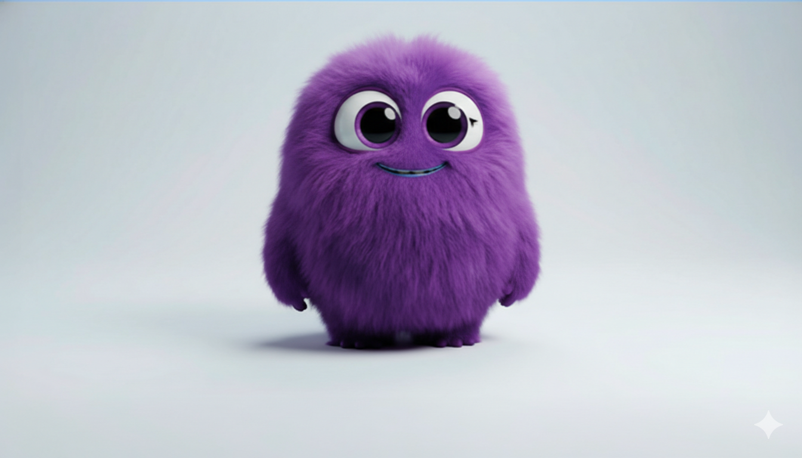

# 👾 Projeto 404 – Monstrinho

Uma página de **Erro 404 (Not Found)** criativa e moderna, desenvolvida para transformar uma experiência negativa em algo visualmente marcante e interativo.

O projeto apresenta um **personagem monstrinho roxo** como elemento central, combinado com **vídeo em background dinâmico**, foco em performance e design totalmente responsivo.

---

## 📸 Preview

<div align="center">
  
</div>

---

## 🚀 Tecnologias Utilizadas

- **HTML5** – Estruturação semântica e acessível.
- **CSS3** – Layout com Flexbox, posicionamento absoluto, gradientes, sombras e animações suaves.
- **JavaScript (Vanilla JS)** – Manipulação do DOM e injeção otimizada do vídeo de fundo.
- **SVG** – Renderização vetorial escalável do “404”.
- **Google Fonts (Poppins)** – Tipografia moderna e legível.

---

## ✨ Principais Funcionalidades

✔ **Vídeo em Background**

- Carregamento assíncrono do vídeo (`Flow.mp4`)
- Ajuste automático para tela cheia
- Otimização para performance e fluidez

✔ **Design Responsivo**

- Layout adaptável para desktop, tablet e mobile
- Ajustes inteligentes de proporção e alinhamento

✔ **Interatividade Visual**

- Efeitos de hover suaves
- Feedback visual nos botões e navegação
- Transições refinadas

✔ **Legibilidade em Fundo Dinâmico**

- Uso de sombras e contraste estratégico
- Equilíbrio entre estética e usabilidade

---

## 📂 Estrutura do Projeto

```
📁 projeto-404-monstrinho
 ├── index.html      # Estrutura principal
 ├── style.css       # Estilização e responsividade
 ├── script.js       # Lógica do vídeo e manipulação do DOM
 └── img/            # Imagens, vetores e vídeo
```

---

## 🔧 Como Executar Localmente

1️⃣ Clone o repositório:

```bash
git clone https://github.com/seu-usuario/Page-Erro404-Animation.git
```

2️⃣ Acesse a pasta do projeto:

```bash
cd Page-Erro404-Animation
```

3️⃣ Abra o arquivo `index.html` no navegador.

---

## 🎯 Objetivo do Projeto

Este projeto foi desenvolvido para praticar:

- Manipulação do DOM com JavaScript
- Controle de mídia via JS
- Responsividade moderna com CSS
- Estruturação limpa e organizada de arquivos

---

Desenvolvido com 💜 por **Ylgner Witoszynski Santana**

---
